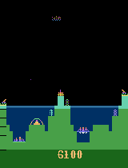
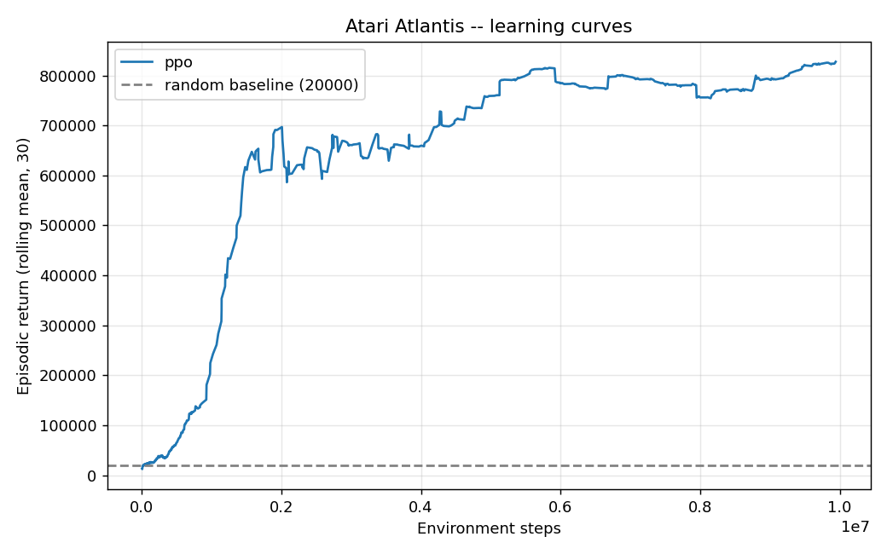

# Deep Reinforcement Learning on Atari Atlantis (A2C and PPO)

A clean, reproducible study of deep reinforcement learning on the Atari 2600 game
**Atlantis** (`ALE/Atlantis-v5`). The training loops are written in PyTorch
following the CleanRL reference implementations (rather than calling a high-level
RL library), and the project trains two on-policy actor-critic agents and compares
them:

- **PPO** (Proximal Policy Optimization), the final agent. It masters the game.
- **A2C** (synchronous Advantage Actor-Critic), the baseline it is compared against.

The aim was not to top a leaderboard. It was to build an honest, well-engineered
pipeline that demonstrably learns, and to document the engineering and the failure
modes along the way, which is where most of the real work in RL actually lives.



## Headline result

| Agent | Score (stochastic eval) | vs random (~20,000) |
| --- | --- | --- |
| Random policy | ~20,000 | baseline |
| A2C (3M steps) | ~58,000 | about 3x |
| **PPO (10M steps)** | **~820,000** | **about 40x** |

At its plateau the PPO agent reaches the Atari time limit (about 27,000 steps) on
every episode: it stops dying and plays the whole level, so the score becomes a
function of time rather than of survival. In other words, within this setup it has
effectively solved the game.



## The engineering journey

The project began as a coursework version that never actually learned: its "score"
was essentially the passive baseline. Rebuilding it into a working agent meant
finding and fixing a chain of concrete problems, each documented here because the
diagnosis is the interesting part.

1. **A broken advantage target.** The original code summed one step's reward but
   bootstrapped with `gamma**n * V(s')`, a mis-discounted N-step return. Replaced
   with proper **GAE(lambda)** and correct terminal masking. A shape bug in the
   value head (returning `(N, 1)` instead of `(N,)`, which broadcast into `(N, N)`
   inside GAE) was fixed along the way.

2. **Reward magnitude swamped the value function.** Atlantis rewards are large
   (hundreds per event, hundreds of thousands per episode). Fed to the critic raw,
   the value loss dominates the policy and entropy gradients and the actor barely
   moves. Fix: the learning signal is sign-clipped, while the reported episode
   returns stay the true, unclipped game score.

3. **Firing is edge-triggered, so dropping NOOP backfires.** An early "optimisation"
   restricted the action space to the three FIRE actions. The gun only fires on the
   released-to-pressed transition, so a policy that always sends a FIRE action holds
   the button down and fires exactly once. The probe in `diagnose.py` makes this
   concrete: every constant action scores a flat 2,000 (the passive wave bonus,
   about 420 steps), while a random policy that interleaves NOOP scores ~16,840 over
   about 1,300 steps. Fix: keep the full action set.

4. **Deterministic evaluation collapses.** For the same edge-triggered reason, an
   argmax (greedy) policy holds one button and falls back to the passive 2,000.
   Evaluation therefore samples from the policy, which measures what the agent
   actually learned rather than a degenerate projection of it.

5. **A2C learns, but slowly; PPO masters it.** With the fixes in place, A2C climbs
   above random but only reaches ~58,000 after 3M steps. PPO, reusing the same
   network and environment, reaches ~590,000 at 1M steps and plateaus near
   ~820,000, far more sample-efficient and stable.

6. **Reward representation, tested properly.** Once the agent maxed out survival,
   the only remaining headroom was scoring efficiency, so two alternatives to
   sign-clipping were tried as controlled A/B runs. Plain reward scaling (raw x0.01)
   failed: the unclipped targets are too large and high-variance, the critic never
   fits, and it stays at random level. **Pop-Art** value normalization (optional,
   behind `--popart`) is the principled fix for that and does learn, but about ten
   times slower than sign-clipping on this game. Sign-clipping remained the best
   choice, and the two experiments are kept as honest negative results.

## Setup

Requires **Python 3.8 to 3.11** (the pinned `ale-py==0.8.1` has no wheels for 3.12+).

```bash
python -m venv .venv
# Windows: .venv\Scripts\activate    Linux/macOS: source .venv/bin/activate
pip install -r requirements.txt
```

The `gymnasium[atari,accept-rom-license]` dependency fetches and installs the Atari
ROMs for you (see the note on ROMs below). A CUDA-capable GPU is strongly
recommended for training; CPU is fine for the smoke test and the diagnostics.

## Reproduce

```bash
# Final agent: PPO (about 6 hours on a laptop GPU for 10M steps)
python -m atari_rl.ppo --cuda --total-timesteps 10000000 --seed 1

# Baseline: A2C
python -m atari_rl.a2c --cuda --total-timesteps 3000000 --seed 1

# Random baseline (the bar to beat)
python -m atari_rl.evaluate --algo random --episodes 30

# Evaluate a trained agent and record a short clip
python -m atari_rl.evaluate --algo ppo --checkpoint runs/<run>/model.pt --episodes 2 --record --max-steps 2000

# Learning-curve figure from the logged CSVs
python -m atari_rl.plot --runs ppo=runs/<ppo-run> a2c=runs/<a2c-run> --random 20000 --out assets/learning_curve.png

# The reward-structure probe used in finding 3
python -m atari_rl.diagnose --episodes 5
```

Each run writes `runs/atlantis__<algo>__seed<seed>__<timestamp>/` containing
`episodes.csv`, `evals.csv`, a TensorBoard log, and `model.pt`.

## Repository layout

```
atari_rl/
  envs.py       Atari wrappers (incl. the optional fire-only wrapper) + vector env
  models.py     Nature-CNN actor-critic (shared torso, policy and value heads)
  ppo.py        PPO trainer (final agent; GAE, clipped objective, optional Pop-Art)
  a2c.py        A2C trainer (baseline)
  popart.py     optional Pop-Art value normalization (off by default)
  evaluate.py   stochastic evaluation + random baseline + video recording
  diagnose.py   fixed-policy probe: does the reward depend on the action?
  plot.py       learning-curve plots from the CSV logs
  utils.py      seeding + CSV logging
```

## Key hyperparameters (defaults)

| PPO | | A2C | |
| --- | --- | --- | --- |
| parallel envs | 8 | parallel envs | 8 |
| rollout length | 128 | rollout length | 16 |
| epochs / minibatches | 4 / 4 | update | 1 full batch |
| clip coefficient | 0.1 | learning rate | 7e-4 |
| learning rate | 2.5e-4 | gamma / lambda | 0.99 / 0.95 |
| gamma / lambda | 0.99 / 0.95 | entropy / value coef | 0.01 / 0.5 |

All are overridable from the command line (`--help` on each module).

## A note on the game, the ROM, and copyright

This is a non-commercial, educational research project. Atlantis is the property of
its original publisher (Atari), and this repository does not claim any affiliation
or endorsement. It ships **no game ROM**: the ROM is fetched locally at install time
through Gymnasium / AutoROM, and users are responsible for obtaining it legally. The
short gameplay clip above was produced from this project's own trained agent and is
included only to illustrate its behavior. The Arcade Learning Environment and
Gymnasium make all of this possible.

## Credits and references

The algorithms used here (A2C, PPO, GAE, the Nature-CNN torso, and Pop-Art) are
standard published methods, credited below. What this project contributes is the
implementation, the debugging and diagnosis, the controlled experiments (including
the negative results), and the empirical analysis on this specific game.

- Training-loop structure follows the [CleanRL](https://github.com/vwxyzjn/cleanrl)
  single-file reference implementations.
- Mnih et al., *Human-level control through deep RL* (Nature, 2015), the CNN torso.
- Mnih et al., *Asynchronous Methods for Deep RL* (2016), A2C/A3C.
- Schulman et al., *Proximal Policy Optimization Algorithms* (2017), and
  *High-Dimensional Continuous Control Using GAE* (2016).
- van Hasselt et al., *Learning values across many orders of magnitude* (2016), Pop-Art.

## License

Released under the MIT License (see [LICENSE](LICENSE)). The license covers the code
in this repository only, not the game or its ROM.
